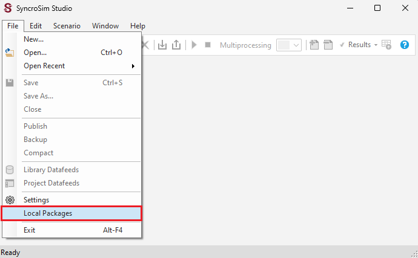
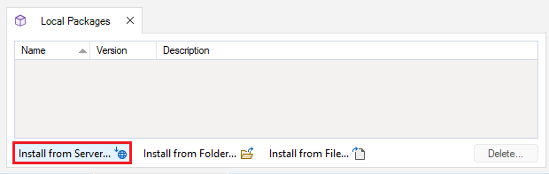
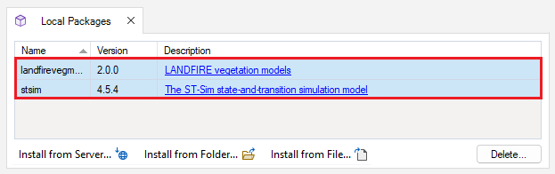
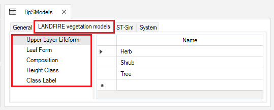
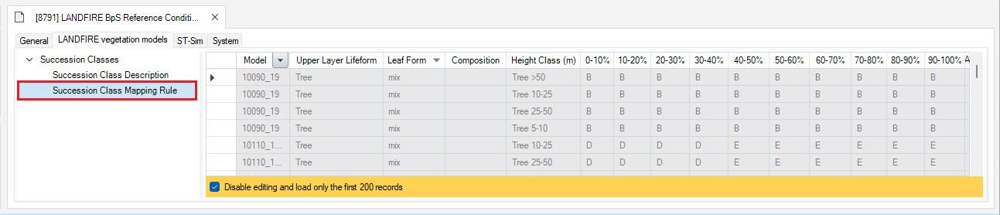

# Getting started with **landfirevegmodels**

This tutorial will provide a brief overview of:
* Installing required packages
* Creating a new **landfirevegmodels** Library 
* Configuring the Library

 

## Installing required packages

Download and install [SyncroSim version 3.1.25](https://syncrosim.com/download/){:target="_blank"} or higher and follow the installation prompts.

Open SyncroSim and select **File > Local Packages… > Install from Server**. Then, mark the check-boxes beside the **stsim** (version 4.5.3 or later).

Repeat the same process for **landfirevegmodels** (version 2.0.0).

 

## Creating a new **landfirevegmodels** Library 

In SyncroSim, select **File > New > From Online Template...**. 

Select the **landfirevegmodels** package and choose either the **CONUS and HI Reference Conditions** for continental U.S. and Hawaii models or the **Alaska Reference Conditions** for models of Alaska.

Enter a **Filename** or keep the default, select a **Folder** for your new library, and click **OK**. A download window should appear and your library will be created from an online template.

 

## Configuring the Library

Right-click on the Project datafeed (*i.e.*, **BpSModels**) and select **Open** (or **double-click** on BpSModels). Navigate to the **LANDFIRE vegetation models** tab, where you can specify details about the quantity, type, and composition of the vegetation for your model.

Open the Scenario datafeed (*i.e.*, the LANDFIRE BpS Reference Condition Models). Navigate to the **LANDFIRE vegetation models** tab, where you can provide further information about the model, including detailed **Succession Class Descriptions** and **Succession Class Mapping Rules**.

 

## Learn more

For documentation on the SyncroSim user interface see the SyncroSim [Getting Started](http://docs.syncrosim.com/getting_started/quickstart.html){:target="_blank"} page.

**landfirevegmodels** runs on ST-Sim. For more information on ST-Sim, see its [documentation](http://docs.stsim.net/){:target="_blank"}.
